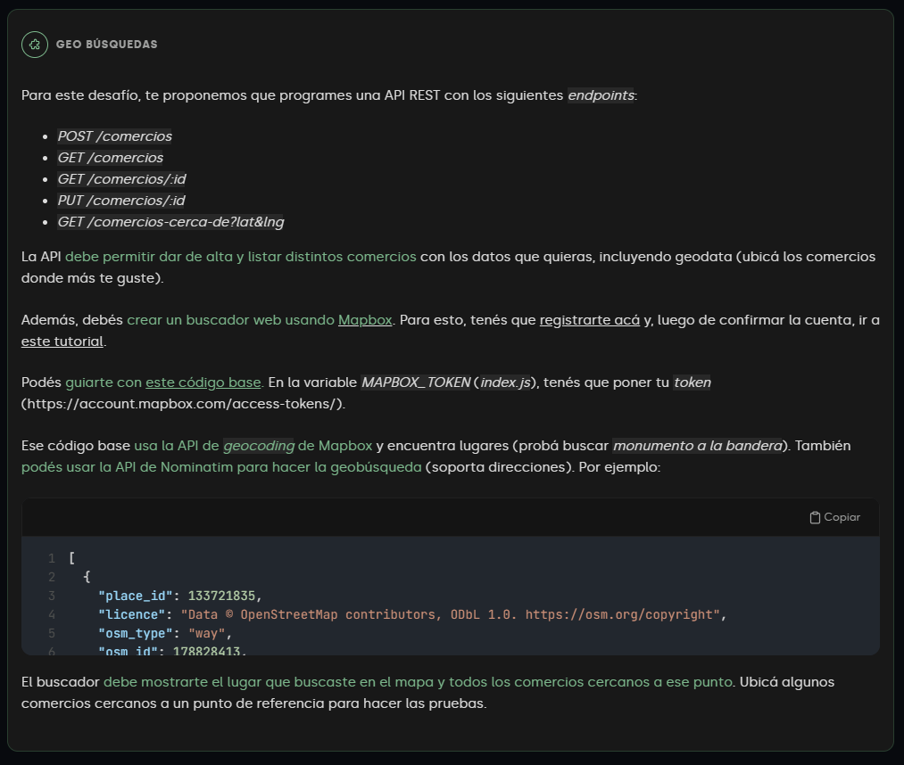

# Simple CRUD API using Algolia and Geolocation

===========================

Learning how to use Algolia to create a simple API for a CRUD.
Learning how to use Geolocation to search for comercios near a location.

## Installation

```bash
npm install
```

## Usage

```bash
npm run dev # Run the server in development mode
npm run start # Run the server in production mode
```

## Pic exercise


